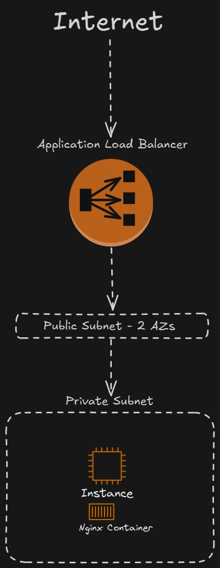

# HA-Devops

Containerize Nginx - Using Terraform

---

# Terraform Deployment Guide for NGINX on AWS

## Overview

This guide provides step-by-step instructions for deploying an NGINX instance on AWS using Terraform. The deployment includes:

- A Virtual Private Cloud (VPC) with 2 public subnets and one private subnet.
- An EC2 instance running NGINX in a private subnet.
- An Application Load Balancer (ALB) for public access.
- Security groups to manage access control.

## Prerequisites

Ensure you have the following installed on your local machine:

- Terraform
- AWS CLI configured

## Architecture Diagram



## Deployment Steps

### 1. Clone the Repository

```sh
 git clone https://github.com/guytamari/HA-Devops.git
 cd terraform
```

### 2. Initialize Terraform

Run the following command to initialize Terraform and download necessary providers:

```sh
terraform init
```

### 3. Validate Configuration

To check for syntax errors and verify correctness:

```sh
terraform validate
```

### 4. Plan the Deployment

To preview the changes Terraform will apply:

```sh
terraform plan
```

### 5. Apply the Configuration

Deploy the infrastructure with:

```sh
terraform apply -auto-approve
```

### 6. Retrieve Load Balancer URL

Once deployment is complete, retrieve the ALB DNS name:

```sh
echo "http://$(terraform output alb_dns_name)"
```

### 7. Verify Deployment

Open a web browser and navigate to the ALB URL. You should see the custom nginx web!

## Destroying the Infrastructure

To remove all deployed resources:

```sh
terraform destroy -auto-approve
```
